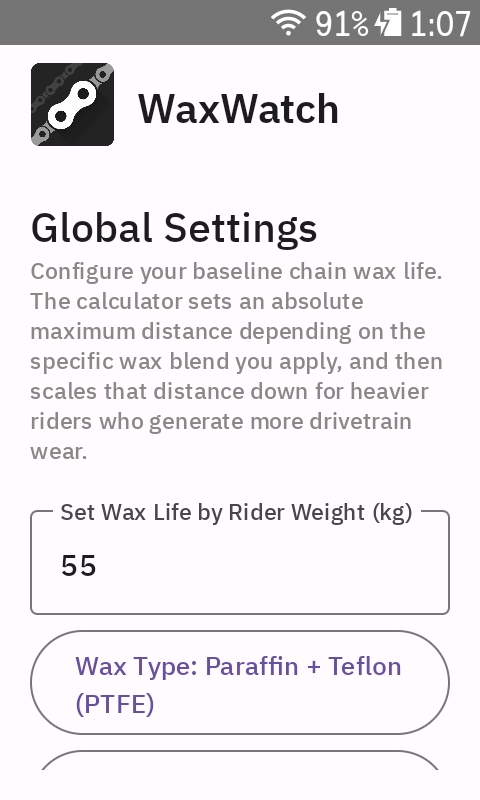
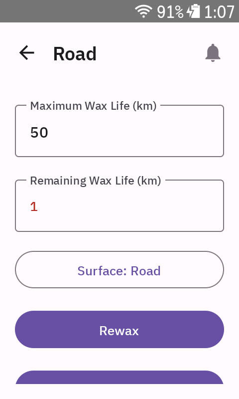

<p align="center">
  
</p>

WaxWatch is a Hammerhead Karoo extension designed to help cyclists track their chain wax life across multiple Activity Profiles. By considering the rider's weight and the surface type ridden on, it calculates a dynamic remaining lifespan for your chain wax, ensuring you re-wax your chain at the optimal time.

## Features

- **Profile-Specific Tracking**: Maps wax life independently to every user-defined Activity Profile on your Karoo.
- **Wax Type Selector**: Choose from popular chain waxes (Generic Paraffin, CeramicSpeed UFO, Silca Secret, etc.) to establish an absolute manufacturer baseline distance.
- **Dynamic Weight Algorithm**: Adjusts the chosen wax baseline symmetrically from a 75kg benchmark — lighter riders get *more* life, heavier riders get *less* (reflecting real-world drivetrain wear differences).
- **Surface Multipliers**: Apply different wear rates based on the typical terrain for each profile:
  - Road: 1.0x wear
  - Commute/Mixed: 1.2x wear
  - Gravel/Dirt: 1.5x wear
- **Automatic Background Tracking**: Registers distance automatically in the background as you ride; no need to have the data field actively displayed on screen.
- **Rewax Alerts**: Set a custom low-life percentage threshold. Once breached during a ride, the Karoo displays a prominent, persistent red alert with the remaining wax distance and profile name, accompanied by a critical audio tone.
- **Unit System**: Full support for Metric and Imperial units with automatic locale detection and manual override.

## Screenshots

<p align="center">
  
  
</p>

## Technical Details

- **Language**: Kotlin
- **UI Framework**: Jetpack Compose
- **SDK**: Built using `com.hammerhead.sdk:extension-sdk`
- **Package**: `net.shinytoaster.waxwatch`

## Getting Started

### Prerequisites

- Android Studio Giraffe | 2022.3.1 or newer.
- A Hammerhead Karoo device or a suitable Android environment for testing out Extension APIs.

### Building the Project

1. Clone or download this repository.
2. Open the project directory (`WaxWatchForKaroo`) in Android Studio.
3. Allow Gradle to sync the project dependencies. This will automatically download the necessary build tools and the Hammerhead Extension SDK.
4. Connect your Hammerhead Karoo device via USB (ensure Developer Options are enabled on the Karoo).
5. Build and Run the `app` configuration, deploying the APK straight to your device.

## Installation

Download the latest APK from the [Releases](../../releases) page of this repository.

### Option 1 — Hammerhead Companion App (easiest)

The Karoo companion app supports installing extensions directly from your phone — no ADB or USB debugging required.

1. Download the latest APK file on your phone browser from the [Releases](../../releases) page.
2. Use the **Share** function on your phone to send the file to the **Hammerhead Companion App**.
3. The Companion app will then prompt you to install it on your connected Karoo.

> [!NOTE]
> This method requires a recent Karoo firmware version and companion app. If the option isn't visible, use the ADB method below.

### Option 2 — ADB via USB (fallback)

1. **Enable Developer Options on your Karoo**: Go to *Settings → Karoo System* and tap the firmware version number several times until a "Developer Options" menu appears. Enable it.
2. **Install ADB** if you don't have it: download [Android Platform Tools](https://developer.android.com/tools/releases/platform-tools).
3. **Connect your Karoo via USB** and confirm it is detected:
   ```
   adb devices
   ```
4. **Install the APK**:
   ```
   adb install WaxWatch-vX.X.X.apk
   ```
5. WaxWatch will appear in the Karoo app list and begin tracking automatically when you start a ride.

## Usage

1. Open the **WaxWatch** app from the Karoo App Launcher.
2. Select your specific **Wax Type** and enter your **Rider Weight (kg)** to automatically calculate your **Base Wax Life** (or manually override it).
3. Set what percentage you want the **Rewax Alert Threshold** to ping you at.
4. Profiles are discovered automatically — they will appear in the app after you start your first ride with each Activity Profile. No manual setup required.
5. Once a profile appears, assign a **Surface Type** (Road, Mixed, or Gravel) and manually set the `Remaining` distance if your chain is already partially worn.
6. *(Optional)* Add the `Wax Life %` or `Wax Rem. Dist` data fields to your ride screens if you want to monitor wax life mid-ride. Tracking continues in the background regardless.
7. Ride! The extension will automatically decrement your wax life based on distance travelled and surface type.
8. If you ride in the rain, open the WaxWatch app, select the affected profile, and hit the **Rain Button**. This immediately deducts 30% of that chain's maximum wax life from its remaining lifespan — a fixed penalty to account for the accelerated wear in wet conditions.
